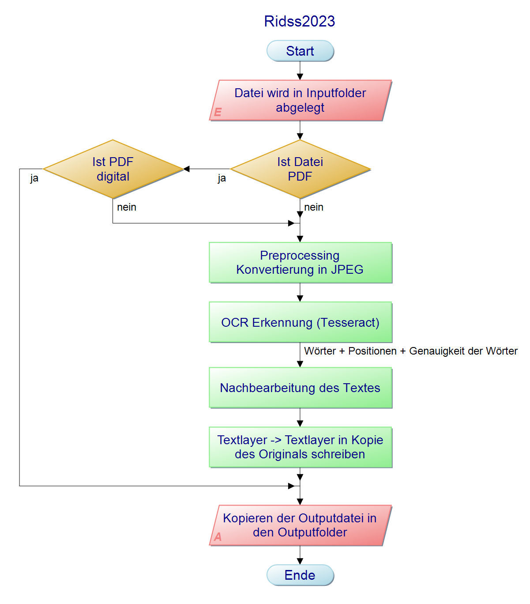

# RIDSS2023

## Prozessablauf

## Quickstart
1. `git clone https://git.scc.kit.edu/von-bis/praktikum/rid/ridss2023.git`
2. `cd docker`
3. `docker-compose -f docker-compose.development.yml up`

## Development in VS Code Devcontainer
1. Clone Git
2. Open Repository in VS Code
3. Run the `Dev Containers: Open Folder in Container...` command from the Command Palette
4. Note: It may take some time until the container is built
